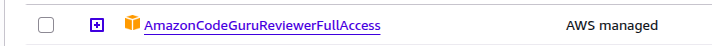
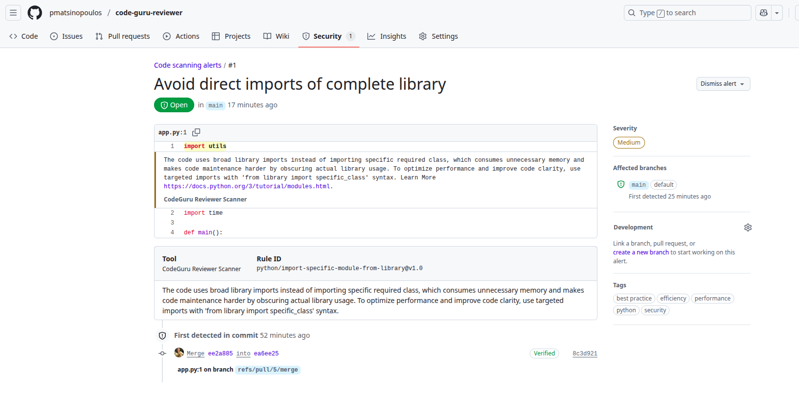

This project is used to demonstrate AWS CodeGuru Reviewer integration.

Note: For that reason, it has some bad practices that we expect them to be flagged from AWS CodeGuru Reviewer.

# Check List

## IAM User

I have an IAM User who has privileges to create CodeConnections.



```json
{
    "Version": "2012-10-17",
    "Statement": [
        {
            "Sid": "VisualEditor0",
            "Effect": "Allow",
            "Action": [
                "codeconnections:RegisterAppCode",
                "codeconnections:CreateConnection",
                "codeconnections:StartOAuthHandshake",
                "codeconnections:ListSyncConfigurations",
                "codeconnections:UpdateSyncConfiguration",
                "codeconnections:GetSyncConfiguration",
                "codeconnections:UpdateSyncBlocker",
                "codeconnections:DeleteSyncConfiguration",
                "codeconnections:GetInstallationUrl",
                "codeconnections:GetSyncBlockerSummary",
                "codeconnections:CreateHost",
                "codeconnections:TagResource",
                "codeconnections:ListRepositoryLinks",
                "codeconnections:UntagResource",
                "codeconnections:GetResourceSyncStatus",
                "codeconnections:ListRepositorySyncDefinitions",
                "codeconnections:GetIndividualAccessToken",
                "codeconnections:StartAppRegistrationHandshake",
                "codeconnections:ListHosts",
                "codeconnections:ListInstallationTargets"
            ],
            "Resource": "*"
        },
        {
            "Sid": "VisualEditor1",
            "Effect": "Allow",
            "Action": "codeconnections:*",
            "Resource": [
                "arn:aws:codeconnections:*:<account-id>:host/*",
                "arn:aws:codeconnections:*:<account-id>:repository-link/*",
                "arn:aws:codeconnections:*:<account-id>:connection/*"
            ]
        }
    ]
}
```

The same user has full access to Amazon CodeGuru Reviewer by the Amazon Managed
Policy `AmazonCodeGuruReviewerFullAccess`.


User should also have access to push files to the S3 bucket that will be holding the source code to be reviewed.

## S3 Bucket

I have an S3 Bucket at which the GitHub Actions workflow (via the `aws-actions/codeguru-reviewer@v1.1`) is pushing the source code that it can be used by AWS CodeGuru Reviewer to review the code.

## CodeConnection

I need to create a code connection. I do it with `terraform`. The connection to GitHub is created on `pending` state. Then I use AWS Management Console to turn it to `active`.

## Code Guru Reviewer Repository Association

This is created with `terraform` too.

# Example Review Output

This is an example of a review output:



# Think About

## S3 Bucket

It's good idea to have a policy to delete old versions of the code. Otherwise, you will be paying for storage that is not used.

## The GitHub Actions AWS Credentials

Now it is using IAM user credentials. You may want to use other ways to authentication with AWS, ways that are considered more secure. You can read more about this in the documentation of `aws-actions/configure-aws-credentials` [here](https://github.com/aws-actions/configure-aws-credentials)

# Closing Note

[AWS Code Guru Reviewer](https://docs.aws.amazon.com/codeguru/latest/reviewer-ug/welcome.html), at the time of this writing, is very limited in scope of programming languages that it can work with. Only Python and Java.
